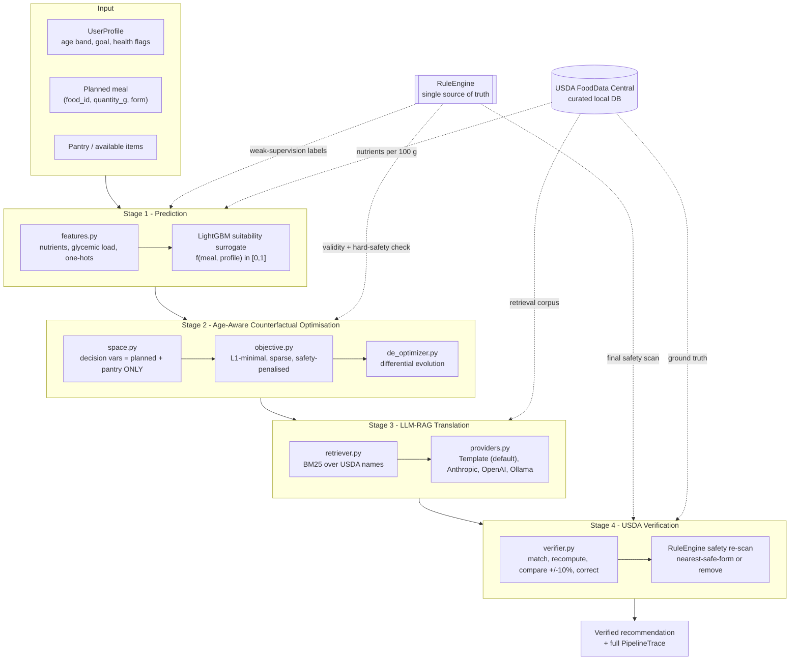

# FoodSense

**Evidence-grounded food recommendations for toddlers (12–36 months) with
nutrition-related health conditions, over Indian regional food data.**

> ### 🚧 Repositioning in progress
> 
> This project is being repositioned following its review. The description below is
> the destination, not yet the state of the code. What currently runs is the
> pre-repositioning system: counterfactual meal editing across three age groups and
> three goals over a USDA corpus, preserved at the tag `v1-multiage-counterfactual`.
> 
> **Read [`docs/pivot.md`](docs/pivot.md) before using or evaluating this repository.**
> Progress against the mandate is tracked section by section in
> [`docs/review_traceability.md`](docs/review_traceability.md); the mandate itself is
> [`docs/review_requirements.md`](docs/review_requirements.md).

[](https://github.com/aarush093/foodsense/actions/workflows/ci.yml)
[](https://www.python.org/downloads/)
[](LICENSE)
[](#quickstart)

- **Who it is for.** Toddlers aged 12–36 months, and only toddlers. Age is not a
  filter applied at the end — it drives retrieval, nutritional interpretation,
  candidate ranking and every safety check.
- **What it reasons about.** Toddler-relevant nutrition conditions — iron-deficiency
  anemia, undernutrition, vitamin D deficiency, functional constipation, celiac
  disease — each enabled only once cited pediatric evidence for it exists in the
  repository. A condition with no sources stays switched off.
- **What it recommends from.** North and South Indian regional foods as the primary
  corpus, with USDA retained as a supplementary source. Every food row carries its
  provenance, and no nutritional value is ever fabricated.
- **How it answers.** Retrieval-augmented generation with vector search over both food
  data and condition evidence, a constrained optimiser between retrieval and
  generation, and a verification pass that re-grounds every claim against the source
  it came from. Where the evidence is insufficient, it says so instead of answering.

It is a nutritional decision-support tool. It does not diagnose, treat, or replace a
pediatrician or a registered dietitian.

---

## What this extends, and what is not verified

FoodSense extends **MetaPlate** (Arefeen, Johnston & Ghasemzadeh, IEEE JBHI 2026 —
arXiv:2606.10120), which pairs a postprandial-glucose predictor with a counterfactual
optimiser and an LLM-RAG translation layer, along five axes: availability-awareness,
modification-based editing, post-generation verification, generalised health goals, and
age/life-stage personalisation.

No evaluation number appears in this repository until the script that produces it
has actually been run. The pre-repositioning results are archived under
`results/archive/v1_multiage_counterfactual/` with their hash manifest; see
[Results](#results).

Two things are **not** verified, and are labelled as such wherever they appear: the
Docker build (Docker is not installed on the development machine, so it has never been
executed) and the LLM providers (no API key in the development environment — the offline
template path is the one that is exercised).

---

## Architecture



### The four stages

| Stage | Module | What it does |
|-------|--------|--------------|
| 1 · Prediction | `stage1_prediction/` | A goal-conditioned **meal-suitability surrogate** `f(nutrients, age_group, goal, health_flags) → [0,1]`, trained on weak-supervision labels from the guideline `RuleEngine`. It is the smooth objective the optimiser climbs — *not* the verifier. |
| 2 · CF optimisation | `stage2_optimizer/` | Differential evolution over `(quantity_g, form)` for every item in `planned_meal ∪ pantry` — and nothing else. Minimises `λ₁·(target − f) + λ₂·L1 + λ₃·sparsity` under hard safety penalties. |
| 3 · LLM-RAG translation | `stage3_rag/` | BM25 retrieval over USDA names grounds the optimised vector in real foods; a provider renders it as age-appropriate language. The default `TemplateProvider` is deterministic and needs no network. |
| 4 · Verification | `stage4_verification/` | Every generated item is re-matched to the USDA DB, its nutrients recomputed from ground truth, mismatches beyond ±10 % corrected, and a final hard-safety scan applied. |

### Why an ML model when we already have rules?

Because they do different jobs. The `RuleEngine` is a **discontinuous verifier** — ideal for
"is this meal safe and compliant?", useless as a search objective, because it gives an
optimiser no gradient to follow. The Stage-1 surrogate learns a **smooth, generalising
approximation** of guideline compliance that differential evolution can actually climb.
Validity is then judged by the rules, never by the surrogate, so the optimiser cannot game
its own model. This mirrors MetaPlate exactly, where the learned glucose model is distinct
from the 140 mg/dL threshold check. The long-form argument is in
[`docs/architecture.md`](docs/architecture.md).

---

## The five extensions over MetaPlate

| # | Extension | How it is implemented (not a promise — a file) |
|---|-----------|-----------------------------------------------|
| 1 | **Availability-aware** | `stage2_optimizer/space.py` builds decision variables *only* from `planned_meal ∪ pantry`. Unavailable foods are not penalised — they do not exist in the search space. |
| 2 | **Modification-based editing** | The optimiser starts from the user's own meal and pays `λ₂·L1 + λ₃·sparsity` for every gram and every item it touches. Pantry items start at 0 g, so a substitution only happens when it is worth its cost. |
| 3 | **Post-generation verification** | `stage4_verification/verifier.py` — match, recompute, compare, correct, re-scan. Its `VerificationReport` counts are the headline metric. |
| 4 | **Generalised health goals** | `configs/goals/{glycemic_control,weight_management,balanced_nutrition}.yaml`, layered with age-specific nutrient targets. |
| 5 | **Age/life-stage personalisation** | `configs/age_groups/{toddler,adult,older_adult}.yaml` — choking `(category, form)` bans with a nearest-safe-form map, medication–food interaction rules, and texture (IDDSI-style) constraints. |

**Choking hazards are a property of `(ingredient, preparation form)`, not of the ingredient.**
Whole grapes are unsafe for a toddler; quartered grapes are not. That is why every meal item
is a `(food_id, quantity_g, form)` triple — it lets the optimiser fix a hazard by changing the
*form*, which costs far less than removing the food.

---

## Quickstart

Requires Python 3.11+ (and Node 18+ only if you want the web UI).
**No API keys. No internet after setup.**

```bash
git clone https://github.com/aarush093/foodsense.git
cd foodsense

make setup    # create .venv, install dependencies
make data     # build the curated USDA food database
make train    # train the Stage-1 suitability surrogate
make demo     # run all three demo scenarios end-to-end

make serve    # build the UI and serve it + the API on http://127.0.0.1:8000
```

**No API key is needed and nothing reaches the network.** Every command above —
including the web UI — runs entirely locally against the committed USDA database
and the trained surrogate. An LLM is an optional enhancement for Stage 3, never a
dependency, and if you do not set a key the demo does not change behaviour: it
simply uses the deterministic template it always uses.

> **If you intend to demo the LLM path**, run it once beforehand:
> `foodsense recommend --scenario toddler_choking --provider anthropic`.
> The pinned model id is checked against Anthropic's published model list but has
> **not** been exercised against the live API from this repository — there is no
> key in the development environment. A wrong or retired id would surface as a
> 404 recorded in `trace.warnings`, with the template answer still returned, but
> you want to find that out in advance rather than on stage.

`make serve` binds **loopback only**. That is the entire security boundary and it
is deliberate: there is no auth because there is nothing here to authenticate
against, and binding every interface would turn a laptop demo into an
unauthenticated service on whatever network you are on.

<details>
<summary><b>Windows (no GNU make)</b></summary>

GNU `make` is not installed on Windows by default. `make.ps1` mirrors every target:

```powershell
./make.ps1 setup
./make.ps1 data
./make.ps1 train
./make.ps1 demo
./make.ps1 serve
```

Or drive the CLI directly, which is what `serve` does underneath:

```powershell
.\.venv\Scripts\python.exe -m foodsense.cli serve
.\.venv\Scripts\python.exe -m foodsense.cli serve --no-open --port 8080
```
</details>

Docker — **present but unverified**:

```bash
docker compose up --build     # -> http://127.0.0.1:8000
```

> The `Dockerfile` and `docker-compose.yml` are written and committed, but **Docker is
> not installed on the development machine, so this build has never been executed**.
> Treat it as untested: it may well need adjusting. Verifying it is a CI task, and it
> is the one item on the roadmap that is written down rather than demonstrated. The
> demo path does not involve Docker — use `make serve`, which is the path that is
> tested.

---

## Demo scenarios

| Scenario | Profile | The problem | What FoodSense does |
|----------|---------|-------------|---------------------|
| `toddler_choking` | Toddler, 18 mo, balanced nutrition + iron focus | Whole grapes and whole peanuts are choking hazards | Re-forms grapes to `quartered` (a form fix, not a removal); substitutes the peanuts from the pantry; verifies every quantity against USDA |
| `elderly_sodium` | Older adult, 78 y, hypertension | Canned soup + salted crackers blow the 500 mg/meal sodium cap | Minimal swap to low-sodium broth, chicken and carrots; final sodium verified ≤ 500 mg |
| `adult_weight` | Adult, weight management | Burger and fries — over the kcal cap, under the protein floor | Demonstrates the generalised-goal objective on a third goal profile |

```bash
foodsense recommend --scenario toddler_choking
foodsense demo                                  # all three
```

---

## Results

**No current evaluation numbers.** Every result this project had produced measures the
pre-repositioning system -- three age groups, three goals, a USDA-only corpus -- which
is a population and an objective set the project no longer serves.

Those artefacts are archived, byte-identical and with their original hash manifest, at
[`results/archive/v1_multiage_counterfactual/`](results/archive/v1_multiage_counterfactual/).
The code that produced them is reachable from the annotated tag
`v1-multiage-counterfactual`. Verify them at any time:

```bash
make verify-results          # or: ./make.ps1 verify-results
```

New evaluation lands in **P9**, on the toddler and condition harness: retrieval metrics
(P@K, R@K, MRR), RAG metrics (context relevance, faithfulness by citation check), and
recommendation metrics (constraint satisfaction, evidence-grounded rate), against a new
ablation ladder. See [`docs/pivot.md`](docs/pivot.md).

No number appears in this repository until the script that produces it has actually
run. That held before the repositioning and it holds now -- which is why this section
states none.

## Reproducibility

Everything is seeded and every artefact is regenerable from a clean clone.

| What | How |
|---|---|
| Seed | `SEED = 42`, set once in `configs/pipeline.yaml` and threaded through data sampling, label noise, the train/test split and every optimiser run |
| Regenerate all results | `make eval` (about 90 minutes, strictly sequential — `run_validity_decomposition` reads the rows `run_cf_eval` writes) |
| Confirm nothing moved | `make verify-results` — diffs the archived set against its `MANIFEST.sha256` and classifies each change as IDENTICAL / EXPECTED / UNEXPECTED. Pass `--results-dir` to check a different set |
| Rebuild the food database | `make data` |
| Retrain Stage 1 | `make train` |
| Environment | Developed on Python 3.12 and Node 24; the package declares `>=3.11` and CI runs the suite on **both 3.11 and 3.12**. Exact pins in `requirements.txt` and `frontend/package-lock.json` |

Clean-clone check, run before each release — and note the last two steps, which
exist because a defect once hid in exactly the gap between them:

```bash
git clone <url> fresh && cd fresh
python -m venv .venv && .venv/Scripts/python.exe -m pip install -r requirements.txt
.venv/Scripts/python.exe -m pip install -e .
.venv/Scripts/python.exe -m pytest                       # 543 passed
.venv/Scripts/python.exe -m foodsense.cli demo           # all three scenarios, offline
cd frontend && npm install && npm run build && cd ..
cd /some/other/directory                                 # <- deliberately not the clone
<path-to>/fresh/.venv/Scripts/python.exe -m foodsense.cli serve --no-open
```

Wall-clock and generation timestamps are the only things that legitimately differ
between two runs of the same code — `verify_results.py` knows that and ignores
them. Everything else is expected to be byte-identical, and when it was not, that
turned out to be a real bug both times.

Per-artefact commands, if you want one table rather than all of them:

```bash
python experiments/run_cf_eval.py                  # results/cf_comparison.*
python experiments/run_validity_decomposition.py   # results/validity_decomposition.*
python experiments/run_lambda_sweep.py             # results/lambda_sweep.*
python experiments/run_surrogate_boundary.py       # results/surrogate_boundary.*
python experiments/run_verification_eval.py        # results/verification_eval.*
python experiments/run_dataset_comparison.py       # results/dataset_comparison.*
```

---

## Repository layout

```
src/foodsense/
├── schemas.py             # MealItem(food_id, quantity_g, form), UserProfile, PipelineTrace
├── data/                  # USDA DB builder, fuzzy lookup, corpus loaders
├── constraints/           # RuleEngine, age rules, goal thresholds  <- single source of truth
├── stage1_prediction/     # features, weak-supervision labels, LightGBM/XGBoost training
├── stage2_optimizer/      # search space, objective, differential evolution, baselines
├── stage3_rag/            # BM25 retriever, LLM providers, translation
├── stage4_verification/   # the verifier
├── api/                   # FastAPI: /api/recommend, /api/scenarios, /api/foods
├── pipeline.py            # run_pipeline(profile, planned_meal, pantry) -> PipelineTrace
└── cli.py                 # foodsense recommend / demo / serve
frontend/                  # Vite + React + Tailwind single-page UI (built to dist/)
experiments/               # every script that writes into results/
configs/                   # goal + age-group YAML (sourced to NASEM DRI, AAP/CDC, AHA...)
docs/                      # architecture, evaluation, traceability, demo script
```

---

## Roadmap

- [x] **Phase 0** — scaffold, tooling, CI, schemas
- [x] **Phase 1** — data layer (curated USDA DB, Food.com + Nutrition5k loaders)
- [x] **Phase 2** — `RuleEngine`, guideline configs, Stage-1 surrogate
- [x] **Phase 3** — Stage-2 optimiser + DiCE/Wachter/greedy baselines
- [x] **Phase 4** — Stage-3 RAG + Stage-4 verifier + end-to-end pipeline
- [x] **Phase 5** — FastAPI + React UI, served from one origin, offline
- [x] **Phase 6** — full evaluation regenerated and verified against a manifest, docs, ship hygiene

---

## Demo recording

<!-- TODO(Phase 5): replace with docs/assets/demo.gif once the UI is recorded -->
*A recorded click-path of the faculty demo will be embedded here. The written click-path
lives in [`docs/demo_script.md`](docs/demo_script.md).*

---

## Team

<!-- ─────────────────────────────────────────────────────────────────────
     PLACEHOLDER — to be filled in by the project team.
     Nothing here is auto-generated and no names have been invented.
     ───────────────────────────────────────────────────────────────── -->

**Course:** BCSE497J — PROJECT-I
**Institution:** Vellore Institute of Technology

| Name | Registration number |
|------|---------------------|
| _TODO_ | _TODO_ |
| _TODO_ | _TODO_ |

**Guide:** _TODO_
**Department:** _TODO_

---

## Acknowledgements

- **MetaPlate** — Arefeen, Johnston & Ghasemzadeh, *IEEE Journal of Biomedical and Health
  Informatics*, 2026 (arXiv:2606.10120). The four-stage architecture FoodSense extends.
- **USDA FoodData Central** — Foundation Foods and SR Legacy, U.S. Department of Agriculture.
- **Food.com Recipes and Interactions** — Li et al., via Kaggle.
- **Nutrition5k** — Thames et al., Google Research.
- Guideline values are sourced to NASEM Dietary Reference Intakes, AAP/CDC infant and
  toddler feeding guidance, the Dietary Guidelines for Americans, AHA and ESPEN/ASPEN.
  Every threshold in `configs/` carries its source as a YAML comment.

## License and data provenance

The **code** in this repository is MIT — see [LICENSE](LICENSE). The **data** is
not ours to license, and is treated separately.

| Source | What is in this repo | Terms |
|---|---|---|
| USDA FoodData Central (SR Legacy, Foundation Foods) | `data/processed/` — a curated 2,590-food subset with the 33-nutrient vectors | Public domain (U.S. Government work) |
| Food.com Recipes and Interactions | `data/samples/foodcom_sample.csv` — 500 real rows, seeded sample | Upstream terms apply; see the dataset's own page |
| Nutrition5k (Google Research) | `data/samples/nutrition5k_sample.csv` — 300 real rows, seeded sample | Upstream terms apply; see the dataset's own page |

The two corpus samples are committed **only** so that a fresh clone can run the
pipeline and the full test suite with no network and no credentials. They are
small seeded extracts, not redistributions of the datasets: the full corpora are
downloaded into `data/raw/`, which is gitignored and never committed. Exact row
counts, extraction rules and seeds are in
[`data/samples/README.md`](data/samples/README.md), and the download sources in
[`data/README.md`](data/README.md).

Guideline thresholds are derived from published public-health guidance (NASEM DRI,
AAP/CDC, DGA 2020–2025, AHA, ESPEN/ASPEN, IDDSI). Each one carries its source as a
comment beside it in `configs/`. They are an implementation of published guidance,
not clinical advice, and this system is a capstone research prototype rather than a
dietary tool for real use.
